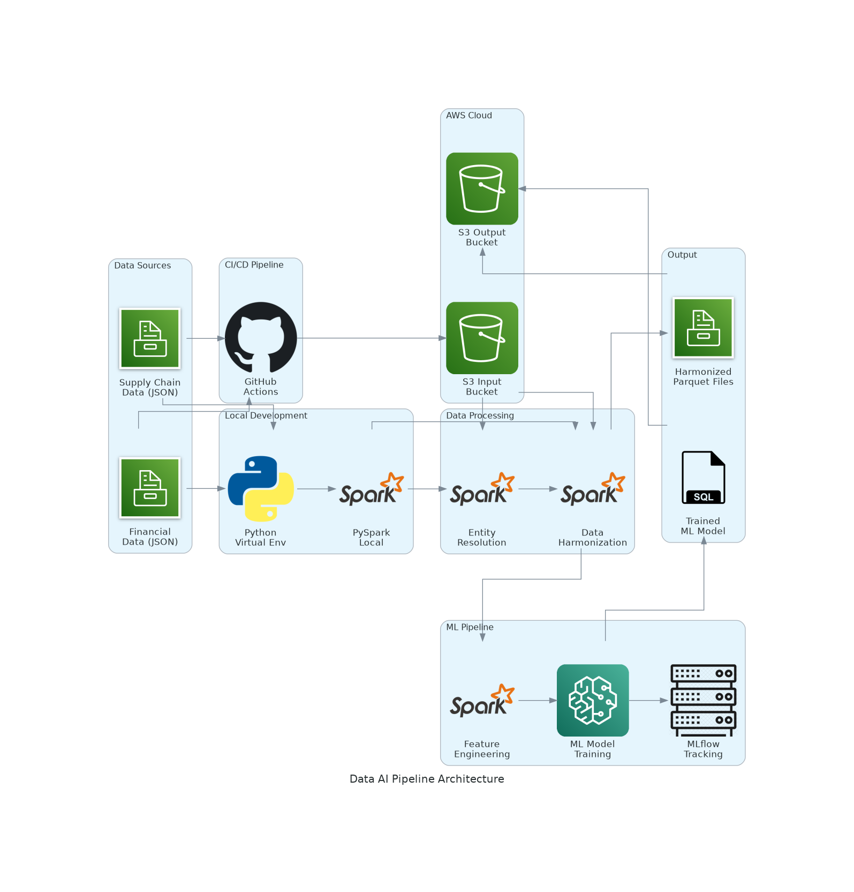

# Data & AI Engineering Pipeline with Apache Iceberg

## 🚀 Cloud-Based Data Pipeline

This project demonstrates a scheduled-style data+ML job that reads **two source datasets from S3**, performs **entity resolution / harmonization**, upserts into an **Apache Iceberg** table, then trains a **PySpark ML** model and registers metadata to a lightweight registry.

---

## Quick Start - Deploy to AWS Cloud

### Prerequisites
- GitHub account
- AWS account with appropriate permissions
- Git

### Steps

#### 1. Fork/Clone Repository
```bash
git clone https://github.com/your-username/data-ai-pipeline.git
cd data-ai-pipeline
```

#### 2. Configure AWS CLI (for initial setup)
```bash
# Install AWS CLI
pip install awscli

# Configure AWS credentials
aws configure
# Enter your AWS Access Key ID, Secret Access Key, region (e.g., us-east-1), output format (json)
```

#### 3. Create AWS Resources
```bash
# Create S3 bucket (replace 'your-unique-bucket-name' with your actual bucket name)
aws s3 mb s3://your-unique-bucket-name

# Upload sample data (or your real sources) to S3
aws s3 cp data/supply_chain_data.json s3://your-unique-bucket-name/data/supply_chain_data.json
aws s3 cp data/financial_data.json s3://your-unique-bucket-name/data/financial_data.json

# Create Glue database
aws glue create-database --database-input Name=corporate_data
```

#### 4. Configure GitHub Secrets
Go to your GitHub repository → Settings → Secrets and variables → Actions

Add these repository secrets:
```
AWS_ACCESS_KEY_ID: your-aws-access-key-id
AWS_SECRET_ACCESS_KEY: your-aws-secret-access-key  
S3_BUCKET: your-unique-bucket-name
```

#### 5. Enable GitHub Actions
- Go to your repository → Actions tab
- Click "I understand my workflows, go ahead and enable them"
- You'll see 2 workflows: **"Data AI Pipeline"** (simple) and **"CI/CD Pipeline"** (advanced)

#### 6. Run Pipeline

**Option A: Simple Execution (Recommended)**
- Go to GitHub repository → Actions tab
- Click **"Workflow4"** workflow (manual cloud run)
- Click "Run workflow" button
- Select branch and click "Run workflow"

**Option B: Full CI/CD Pipeline**
- Go to GitHub repository → Actions tab  
- Click **"CI/CD Pipeline"** workflow
- Click "Run workflow" button
- Note: Requires EMR cluster setup (see Advanced Setup below)

**Option C: Automatic Trigger**
```bash
git add .
git commit -m "Deploy pipeline to cloud"
git push origin main
# This automatically triggers the CI/CD Pipeline
```

#### 7. Monitor Execution
- Go to Actions tab in your GitHub repository
- Click on the running workflow
- Monitor each step:
  - Set up Python & Java
  - Install dependencies
  - Configure AWS credentials
  - Upload data to S3
  - Run pipeline
  - Run tests

#### 8. View Results
```bash
# Check S3 for output data
aws s3 ls s3://your-unique-bucket-name/output/

# Download results locally (optional)
aws s3 cp s3://your-unique-bucket-name/output/ ./results/ --recursive
```

---

## Advanced Setup (EMR Integration)

For the full CI/CD Pipeline with EMR, additional setup is required:

### Create EMR Cluster
```bash
# Create EMR cluster (replace cluster name and key pair)
aws emr create-cluster \
  --name "data-ai-pipeline-cluster" \
  --release-label emr-6.15.0 \
  --instance-type m5.xlarge \
  --instance-count 3 \
  --ec2-attributes KeyName=your-key-pair \
  --applications Name=Spark Name=Hadoop \
  --service-role EMR_DefaultRole \
  --ec2-attributes InstanceProfile=EMR_EC2_DefaultRole
```

### Add EMR Cluster ID to GitHub Secrets
```
EMR_CLUSTER_ID: j-XXXXXXXXXX
```

---

## Architecture Overview



This cloud-native data pipeline:
1. **Ingests data** from two corporate data sources (Supply Chain & Financial)
2. **Performs entity resolution** using fuzzy matching on corporate names and addresses
3. **Harmonizes data** into a unified Apache Iceberg table with ACID transactions
4. **Trains ML models** using PySpark ML on the harmonized data
5. **Manages the entire process** with automated GitHub Actions CI/CD

### Architecture Components

#### Data Sources
- **Supply Chain Data**: Corporate names, addresses, activity places, and supplier information
- **Financial Data**: Corporate names, customer information, revenue, and profit metrics

#### Cloud Processing Pipeline
- **GitHub Actions**: Automated CI/CD orchestration
- **AWS S3**: Data lake storage for input and output data
- **AWS Glue**: Metadata catalog for Iceberg tables
- **PySpark**: Distributed data processing and ML training
- **MLflow**: Experiment tracking (optional)
- **Lightweight registry**: JSON registry file (local or S3) for model metadata/versioning

#### Processing Steps
1. **Data Upload**: GitHub Actions uploads data to S3
2. **Entity Resolution**: Uses Levenshtein distance (85% similarity threshold) to match corporate entities
3. **Data Harmonization**: Combines matched entities into unified records with corporate IDs
4. **Feature Engineering**: Creates ML-ready features from harmonized data
5. **ML Training**: Trains classification models using PySpark ML with MLflow tracking
6. **Results Storage**: Saves harmonized data and models to S3

#### Output
- **Harmonized Dataset**: Parquet files with unified corporate records in S3
- **ML Models**: Trained models with performance metrics tracked in MLflow
- **Experiment Tracking**: Complete lineage and versioning via MLflow

### Entity Resolution Heuristic
- Cleans corporate names (remove punctuation, normalize case)
- Simplifies addresses to city/state combinations
- Uses Levenshtein distance with 85% similarity threshold
- Assigns unique corporate IDs to matched entities

---

## Troubleshooting

### Common Issues

**1. AWS Credentials Error**
- Verify AWS secrets are correctly set in GitHub repository settings
- Check IAM permissions for S3, Glue, and EMR access
- Ensure AWS region matches in secrets and code

**2. S3 Bucket Access Denied**
- Ensure bucket exists and is accessible
- Verify bucket name in GitHub secrets matches actual bucket
- Check S3 bucket permissions

**3. GitHub Actions Workflow Failures**
- Check workflow logs for specific error messages
- Verify all required secrets are set
- Ensure Java 17 and Python dependencies are compatible

**4. EMR Cluster Issues (CI/CD Pipeline)**
- Verify EMR cluster is running and accessible
- Check EMR_CLUSTER_ID secret is correct
- Ensure EMR service roles exist

**5. Data Processing Errors**
- Check S3 data upload completed successfully
- Verify JSON data format is valid
- Review Spark execution logs in workflow output

### View Detailed Logs
1. Go to Actions → Failed workflow
2. Click on failed job
3. Expand each step to see detailed logs
4. Check "Run pipeline" step for Spark execution details

---

## Project Structure
```
├── src/
│   ├── etl_pipeline.py      # Main ETL/ML pipeline
│   ├── local_pipeline.py    # Local execution version
│   ├── cloud_pipeline.py    # EMR/Glue-focused wrapper (S3 inputs)
│   ├── entity_resolution.py # Deduplication logic
│   └── ml_training.py       # ML model training
├── tests/
│   └── test_entity_resolution.py
│   └── test_contracts.py    # Data contract (schema) checks
├── data/
│   ├── supply_chain_data.json
│   └── financial_data.json
├── .github/workflows/
│   ├── pipeline.yml         # Simple GitHub Actions workflow
│   └── ci-cd.yml           # Full CI/CD workflow with EMR
├── terraform/
│   └── main.tf
├── fix_json.py              # JSON format converter
└── requirements.txt
```

---

## Run the pipeline reading sources from S3

Set these environment variables (locally, in GitHub Actions, or on EMR):

```bash
export SOURCE1_URI="s3a://<bucket>/data/supply_chain_data.json"
export SOURCE2_URI="s3a://<bucket>/data/financial_data.json"

# Iceberg catalog (choose one):
# - Local lightweight metastore (default):
export ICEBERG_CATALOG_NAME="local"
export ICEBERG_CATALOG_TYPE="hadoop"
export ICEBERG_WAREHOUSE="file:/tmp/iceberg/warehouse"

# - AWS Glue catalog (typical for EMR):
# export ICEBERG_CATALOG_NAME="glue_catalog"
# export ICEBERG_CATALOG_TYPE="glue"
# export ICEBERG_WAREHOUSE="s3://<bucket>/warehouse"

export MODEL_REGISTRY_URI="s3://<bucket>/models/model_registry.json"
```

Run:

```bash
python -m src.etl_pipeline
```

Query the Iceberg table (example):

```python
spark.sql("SELECT corporate_id, corporate_name, revenue, profit FROM local.corporate_data.corporate_registry").show()
```

---

## Creating a new GitHub repository for this project

If you want this as a brand-new repo:

```bash
gh repo create <your-org-or-user>/<new-repo-name> --public --source . --remote origin
git push -u origin main
```

---

## Workflow Comparison

| Feature | Data AI Pipeline | CI/CD Pipeline |
|---------|------------------|----------------|
| **Trigger** | Manual only | Manual + Auto (push/PR) |
| **Complexity** | Simple | Advanced |
| **AWS Services** | S3 + Glue | S3 + Glue + EMR |
| **Setup Required** | Basic | EMR cluster |
| **Best For** | Testing, demos | Production |
| **Execution Time** | ~5-10 minutes | ~15-30 minutes |

**Recommendation**: Start with "Data AI Pipeline" for initial testing, then move to "CI/CD Pipeline" for production deployments.
